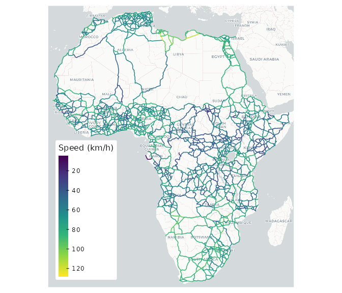
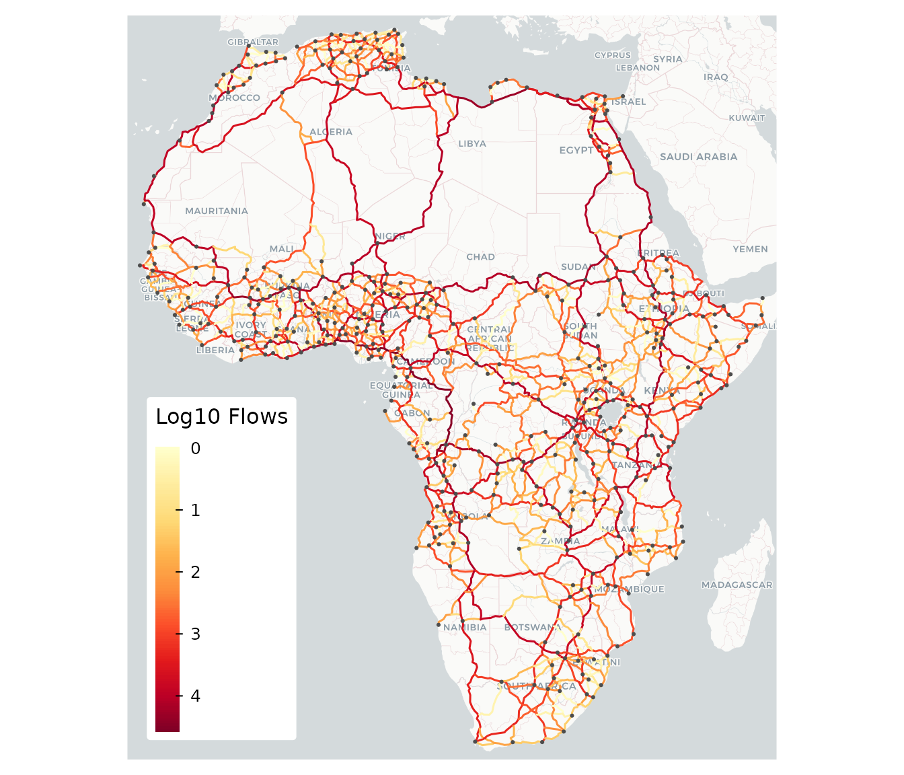
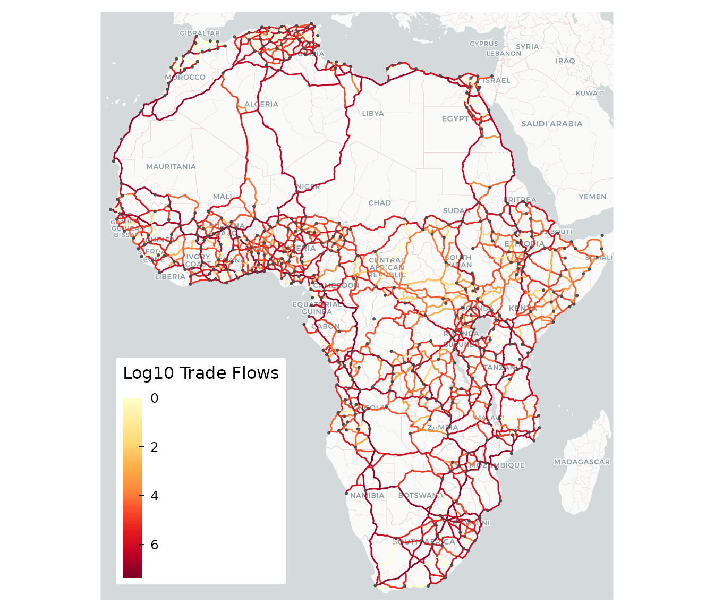
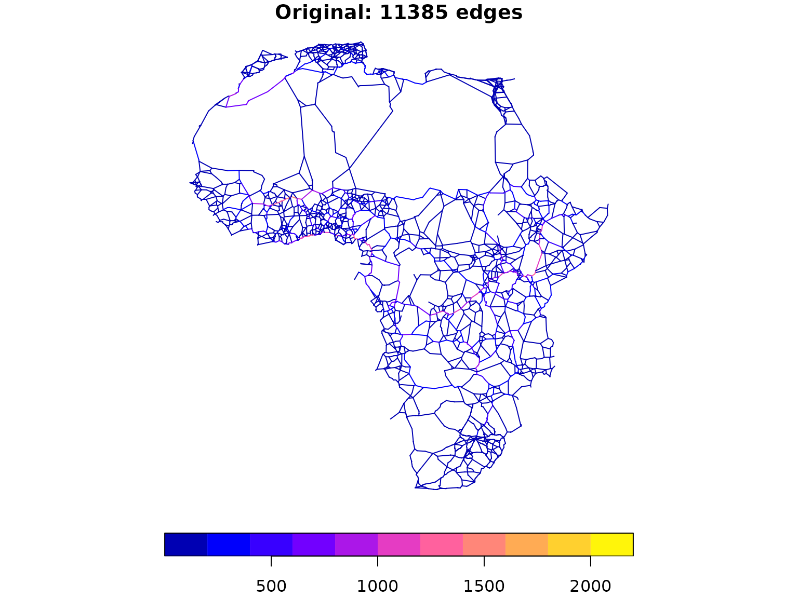
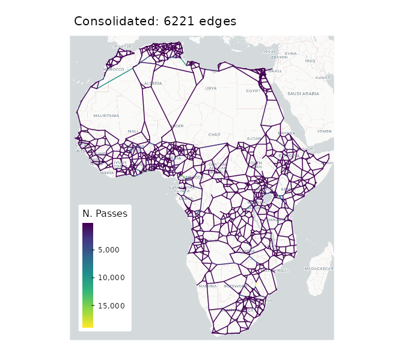
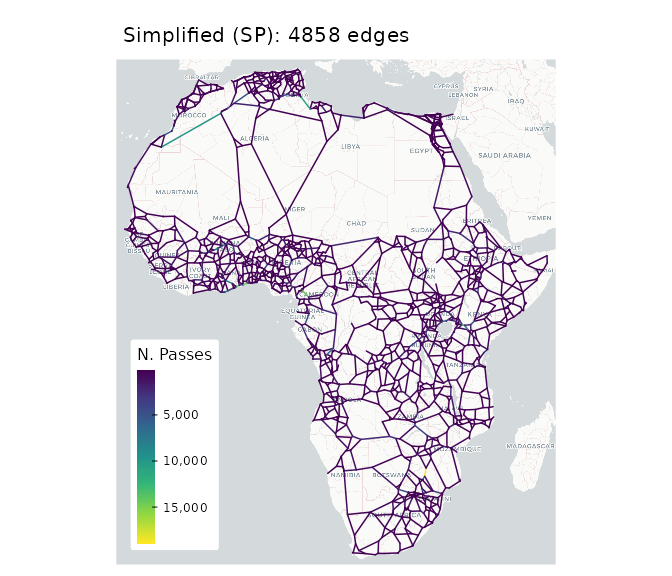
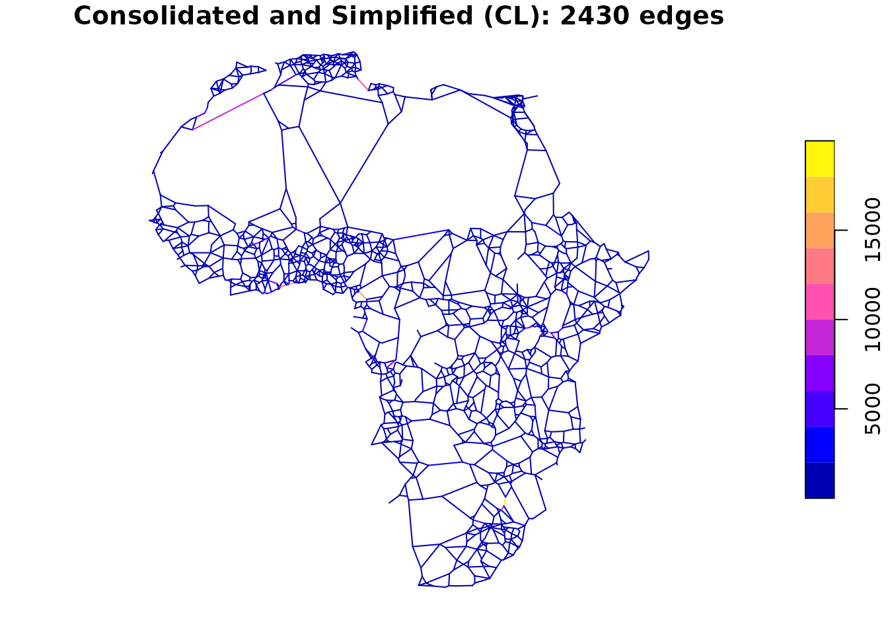
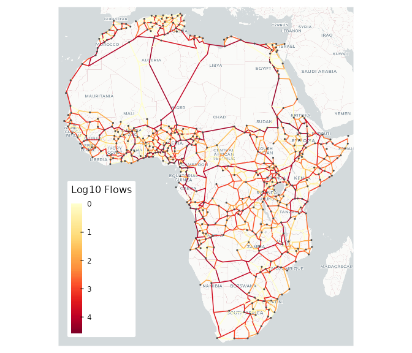

# Introduction to flownet

## Introduction

The `flownet` package provides efficient tools for transportation
modeling, specifically network processing/preparation, route
enumeration, and traffic assignment tasks. The package implements the
**path-sized logit (PSL) model** for traffic assignment, which accounts
for route overlap when assigning traffic flows to network edges. It can
handle directed or undirected graphs, and it’s network processing
functions/algorithms support multimodal networks. A key design decision
was to represent network graphs using simple data frames with `from` and
`to` node columns. This facilitates applied work, e.g., further manual
network edits such as adding multimodal connector links, and the
development of generalized cost functions using network features.

## Getting Started

Let’s start by loading the required packages and exploring the example
datasets included with `flownet`:

``` r
library(fastverse)
fastverse_extend(flownet, sf, tmap)
tmap_mode("plot")
```

The package includes four example datasets for Africa:

- **`africa_network`**: A road transport network with 2,825 LINESTRING
  features representing existing roads (2,344 edges) and proposed new
  links (481 edges). Each edge includes attributes such as distance,
  travel duration, border crossing costs, terrain ruggedness, and road
  upgrade costs.

- **`africa_cities_ports`**: 453 African cities with population \>
  100,000 and international ports. Includes population data, capital
  status, and port cargo outflows.

- **`africa_segments`**: 14,358 raw network segments representing
  intersected road routes. Useful for demonstrating network
  consolidation and simplification functions.

- **`africa_trade`**: Bilateral trade flows between 47 African countries
  aggregated by HS section (21 product categories). Values represent
  annual averages over 2012-2022.

The `africa_network`, `africa_cities_ports`, and `africa_segments`
datasets are from Krantz, S. (2024). [Optimal Investments in Africa’s
Road Network](https://doi.org/10.1596/1813-9450-10893). Policy Research
Working Paper 10893. World Bank. Replication materials are available at
[github.com/SebKrantz/OptimalAfricanRoads](https://github.com/SebKrantz/OptimalAfricanRoads).

Let’s examine the data:

``` r
# View network structure (existing links only)
africa_net <- fsubset(africa_network, !add, -add)
str(africa_net, max.level = 1)
#> Classes 'sf' and 'data.frame':   2344 obs. of  28 variables:
#>  $ from             : int  1 2 2 2 3 3 4 4 5 5 ...
#>   ..- attr(*, "label")= chr "Origin node index"
#>  $ to               : int  2 3 4 5 4 10 5 17 13 17 ...
#>   ..- attr(*, "label")= chr "Destination node index"
#>  $ from_ctry        : chr  "SEN" "SEN" "SEN" "SEN" ...
#>   ..- attr(*, "label")= chr "Origin country ISO3 code"
#>  $ to_ctry          : chr  "SEN" "SEN" "SEN" "SEN" ...
#>   ..- attr(*, "label")= chr "Destination country ISO3 code"
#>  $ FX               : num  -17.4 -17 -17 -17 -16.6 ...
#>   ..- attr(*, "label")= chr "Origin node longitude"
#>  $ FY               : num  14.7 14.7 14.7 14.7 15.1 ...
#>   ..- attr(*, "label")= chr "Origin node latitude"
#>  $ TX               : num  -17 -16.6 -16.5 -16.4 -16.5 ...
#>   ..- attr(*, "label")= chr "Destination node longitude"
#>  $ TY               : num  14.7 15.1 14.8 14.3 14.8 ...
#>   ..- attr(*, "label")= chr "Destination node latitude"
#>  $ sp_distance      : num  43272 63043 62787 78226 43802 ...
#>   ..- attr(*, "label")= chr "Spherical (great-circle) distance in meters"
#>  $ distance         : num  65988 87290 89470 99998 61112 ...
#>   ..- attr(*, "label")= chr "Road distance in meters (OSRM routing)"
#>  $ duration         : num  46.1 72.2 61.1 72.9 72.9 ...
#>   ..- attr(*, "label")= chr "Travel duration in minutes (OSRM routing)"
#>  $ speed_kmh        : num  85.8 72.5 87.9 82.3 50.3 ...
#>   ..- attr(*, "label")= chr "Average speed in km/h (distance/duration)"
#>  $ passes           : num  104.3 10 1.5 55 1 ...
#>   ..- attr(*, "label")= chr "Number of optimal inter-city routes using this edge"
#>  $ gravity          : num  215.33 20.138 11.642 122.201 0.526 ...
#>   ..- attr(*, "label")= chr "Sum of population gravity weights from routes"
#>  $ gravity_rd       : num  157.523 14.738 10.558 88.008 0.395 ...
#>   ..- attr(*, "label")= chr "Sum of road-distance-weighted gravity from routes"
#>  $ border_dist      : num  0 0 0 0 0 0 0 0 0 0 ...
#>   ..- attr(*, "label")= chr "Additional border crossing distance in meters"
#>  $ total_dist       : num  65988 87290 89470 99998 61112 ...
#>   ..- attr(*, "label")= chr "Total distance incl. border crossing penalty (meters)"
#>  $ border_time      : num  0 0 0 0 0 0 0 0 0 0 ...
#>   ..- attr(*, "label")= chr "Additional border crossing time in minutes"
#>  $ total_time       : num  46.1 72.2 61.1 72.9 72.9 ...
#>   ..- attr(*, "label")= chr "Total travel time incl. border crossing (minutes)"
#>  $ duration_100kmh  : num  39.6 52.4 53.7 60 36.7 ...
#>   ..- attr(*, "label")= chr "Hypothetical travel time at 100 km/h (minutes)"
#>  $ total_time_100kmh: num  39.6 52.4 53.7 60 36.7 ...
#>   ..- attr(*, "label")= chr "Hypothetical total time at 100 km/h incl. border"
#>  $ rugg             : num  25204 23657 25761 24773 11332 ...
#>   ..- attr(*, "label")= chr "Terrain ruggedness index along the edge"
#>  $ pop_wpop         : num  670689 191412 177028 137875 65316 ...
#>   ..- attr(*, "label")= chr "Population within corridor (WorldPop)"
#>  $ pop_wpop_km2     : num  2263 450 415 262 216 ...
#>   ..- attr(*, "label")= chr "Population density per km2 along corridor"
#>  $ cost_km          : num  699437 605210 607230 581290 520635 ...
#>   ..- attr(*, "label")= chr "Estimated road construction/maintenance cost per km (USD)"
#>  $ upgrade_cat      : chr  "Asphalt Mix Resurfacing" "Mixed Works" "Asphalt Mix Resurfacing" "Asphalt Mix Resurfacing" ...
#>   ..- attr(*, "label")= chr "Road upgrade category"
#>  $ ug_cost_km       : num  165533 325805 143711 137572 440804 ...
#>   ..- attr(*, "label")= chr "Upgrade cost per km in USD"
#>  $ geometry         :sfc_LINESTRING of length 2344; first list element:  'XY' num [1:10, 1:2] -17.4 -17 -17 -17.1 -17.1 ...
#>  - attr(*, "sf_column")= chr "geometry"
#>  - attr(*, "agr")= Factor w/ 3 levels "constant","aggregate",..: NA NA NA NA NA NA NA NA NA NA ...
#>   ..- attr(*, "names")= chr [1:28] "from" "to" NA NA ...

# View cities/ports
head(fselect(africa_cities_ports, city, country, population))
#> Simple feature collection with 6 features and 3 fields
#> Geometry type: POINT
#> Dimension:     XY
#> Bounding box:  xmin: 3.3841 ymin: -26.2044 xmax: 39.2803 ymax: 30.0444
#> Geodetic CRS:  WGS 84
#>            city          country population                 geometry
#> 1         Cairo            Egypt   28621082  POINT (31.2358 30.0444)
#> 2         Lagos          Nigeria   19932062     POINT (3.3841 6.455)
#> 3      Kinshasa Congo (Kinshasa)   16579488  POINT (15.3119 -4.3219)
#> 4        Luanda           Angola   12376210  POINT (13.2344 -8.8383)
#> 5  Johannesburg     South Africa   12282763 POINT (28.0456 -26.2044)
#> 6 Dar es Salaam         Tanzania    9048912  POINT (39.2803 -6.8161)

# View trade data structure
head(africa_trade)
#>    iso3_o iso3_d section_code
#>    <fctr> <fctr>        <int>
#> 1:    AGO    BDI           16
#> 2:    AGO    BEN            1
#> 3:    AGO    BEN            4
#> 4:    AGO    BEN            5
#> 5:    AGO    BEN            6
#> 6:    AGO    BEN            7
#>                                                                                                                                                                                                   section_name
#>                                                                                                                                                                                                         <fctr>
#> 1: Machinery and mechanical appliances, electrical equipment, parts thereof, sound recorders and reproducers, television image and souch recorders and reproducers, and parts and accessories of such articles
#> 2:                                                                                                                                                                            Live animals and animal products
#> 3:                                                                                                           Prepared foodstuffs, beverages, spirits and vinegar, tobacco and manufactured tobacco substitutes
#> 4:                                                                                                                                                                                            Mineral products
#> 5:                                                                                                                                                               Product of the chemicals or allied industries
#> 6:                                                                                                                                                  Plastics and articles thereof, rubber and articles thereof
#>         hs2_codes     value     value_kd  quantity
#>            <fctr>     <num>        <num>     <num>
#> 1:             84    5.1040    5.1040000    0.9870
#> 2:              3 6810.4528 6527.0068247 8777.0133
#> 3:     19, 20, 22    9.5135    9.0984152   20.7370
#> 4:             27 3583.7897 3536.4303649 8369.7665
#> 5: 30, 32, 33, 34    0.9435    0.9319342    0.0275
#> 6:         39, 40   71.2590   71.9540899   31.2510
```

## Basic Workflow Example

This section demonstrates a complete workflow from network preparation
to traffic assignment and visualization. We’ll use a gravity-based OD
matrix derived from city populations.

### Step 1: Visualize the Network

First, let’s visualize the network to understand its structure:

``` r
# Plot network colored by travel speed
tm_basemap("CartoDB.Positron", zoom = 4) +
tm_shape(africa_net) +
  tm_lines(col = "speed_kmh",
           col.scale = tm_scale_continuous(values = "turbo", values.range = c(0.1, 0.9)),
           col.legend = tm_legend("Speed (km/h)", position = c("left", "bottom"),
                                  frame = FALSE, text.size = 0.8, title.size = 1, 
                                  item.height = 2.5), lwd = 1.5) +
tm_layout(frame = FALSE)
```



### Step 2: Convert Network to Graph

The
[`linestrings_to_graph()`](https://sebkrantz.github.io/flownet/reference/linestrings_to_graph.md)
function converts LINESTRING geometries to a graph data frame format
required for traffic assignment. In this case, the relevant columns are
already provided, thus we only need to strip the geometry column and
turn it into a normal data frame.

``` r
# Convert to graph
graph <- st_drop_geometry(africa_net)
head(graph)
#>   from to from_ctry to_ctry        FX       FY        TX       TY sp_distance
#> 1    1  2       SEN     SEN -17.44671 14.69281 -17.04453 14.70297    43272.22
#> 2    2  3       SEN     SEN -17.04453 14.70297 -16.63849 15.11222    63043.01
#> 3    2  4       SEN     SEN -17.04453 14.70297 -16.46332 14.75651    62786.56
#> 4    2  5       SEN     SEN -17.04453 14.70297 -16.42054 14.34236    78226.09
#> 5    3  4       SEN     SEN -16.63849 15.11222 -16.46332 14.75651    43802.37
#> 6    3 10       SEN     SEN -16.63849 15.11222 -16.24391 15.63569    71956.96
#>   distance duration speed_kmh   passes     gravity  gravity_rd border_dist
#> 1  65988.0    46.15  85.79155 104.3333 215.3302926 157.5228265           0
#> 2  87290.5    72.25  72.49038  10.0000  20.1382178  14.7376257           0
#> 3  89469.5    61.10  87.85876   1.5000  11.6420372  10.5577017           0
#> 4  99998.0    72.90  82.30288  55.0000 122.2011739  88.0080152           0
#> 5  61111.5    72.90  50.29753   1.0000   0.5259515   0.3953356           0
#> 6  73391.0    61.20  71.95196  31.0000  23.0342955  16.8520354           0
#>   total_dist border_time total_time duration_100kmh total_time_100kmh      rugg
#> 1    65988.0           0      46.15         39.5928           39.5928 25203.645
#> 2    87290.5           0      72.25         52.3743           52.3743 23656.895
#> 3    89469.5           0      61.10         53.6817           53.6817 25761.240
#> 4    99998.0           0      72.90         59.9988           59.9988 24773.338
#> 5    61111.5           0      72.90         36.6669           36.6669 11331.973
#> 6    73391.0           0      61.20         44.0346           44.0346  1745.889
#>    pop_wpop pop_wpop_km2  cost_km             upgrade_cat ug_cost_km
#> 1 670689.38    2262.9802 699437.0 Asphalt Mix Resurfacing   165533.4
#> 2 191412.11     450.2150 605210.4             Mixed Works   325804.9
#> 3 177027.86     415.0577 607229.6 Asphalt Mix Resurfacing   143711.0
#> 4 137874.58     262.0664 581289.6 Asphalt Mix Resurfacing   137571.9
#> 5  65316.04     216.0512 520634.9                 Upgrade   440804.2
#> 6 102835.91     212.9464 415457.6             Mixed Works   223654.7
```

The resulting graph data frame contains:

- `edge`: Edge identifier (optional)
- `from`, `to`: Node IDs
- `FX`, `FY`, `TX`, `TY`: Node coordinates (optional)
- All original columns from the network (distance, duration, total_time,
  etc.)

### Step 3: Extract Nodes and Map Cities

Next, we need to map the city/port locations to the nearest network
nodes:

``` r
# Extract nodes with spatial coordinates
nodes <- nodes_from_graph(graph, sf = TRUE)

# Map cities/ports to nearest nodes
nearest_nodes <- nodes$node[st_nearest_feature(africa_cities_ports, nodes)]
```

### Step 4: Create OD Matrix

For this example, we’ll create a simple gravity-based OD matrix from
city populations. The
[`melt_od_matrix()`](https://sebkrantz.github.io/flownet/reference/melt_od_matrix.md)
function converts the matrix to long format required by
[`run_assignment()`](https://sebkrantz.github.io/flownet/reference/run_assignment.md):

``` r
# Create gravity-based OD matrix (population product scaled down)
od_mat <- outer(africa_cities_ports$population, africa_cities_ports$population) / 1e12
dimnames(od_mat) <- list(nearest_nodes, nearest_nodes)

# Convert to long format
od_matrix_long <- melt_od_matrix(od_mat)
head(od_matrix_long)
#>   from to       flow
#> 1    1  1 10.3925963
#> 2    1  6  0.3804031
#> 3    1  8  4.6445025
#> 4    1  8  0.5133217
#> 5    1  9  0.3426110
#> 6    1 11  3.1488124
```

The resulting data frame contains columns `from`, `to`, and `flow`, with
only positive, finite flow values.

### Step 5: Run Traffic Assignment

Now we can run the traffic assignment. The
[`run_assignment()`](https://sebkrantz.github.io/flownet/reference/run_assignment.md)
function:

- Enumerates alternative routes for each OD pair
- Computes path probabilities accounting for route overlap (PSL model)
- Assigns flows to network edges

For large networks like this one, we’ll use the All-or-Nothing (AoN)
method which is faster:

``` r
# Run Traffic Assignment (All-or-Nothing method for speed)
result <- run_assignment(graph, od_matrix_long, cost.column = "duration",
                         method = "AoN", return.extra = "all")
#> Created graph with 1379 nodes and 2344 edges...
#> 495 OD-pairs have zero or non-finite flow values and will be skipped...
print(result)
#> FlowNet object
#> Call: run_assignment(graph_df = graph, od_matrix_long = od_matrix_long,      cost.column = "duration", method = "AoN", return.extra = "all") 
#> 
#> Number of nodes: 1379 
#> Number of edges: 2344 
#> Number of simulations/OD-pairs: 204714 
#> 
#> Average path length in edges (SD): 34.99213  (19.56615)
#> Average number of visits per edge (SD): 3056.049  (5875.129)
#> Average path cost (SD): 4345.631  (2253.376)
#> 
#> Final flows summary statistics:
#>      N  Ndist     Mean       SD  Min       Max  Skew   Kurt
#>   2344   2017  2187.89  4553.86    0  37250.26  3.49  18.49
#>   1%  5%   10%    25%     50%      75%   90%       95%       99%
#>    0   0  1.08  36.57  295.39  1662.86  7581  11386.38  20188.24
```

Key parameters:

- `cost.column`: The cost column to use for route computation (here
  “duration” in minutes)
- `method`: “PSL” (path-sized logit) or “AoN” (all-or-nothing)
- `return.extra`: Additional results to return (“all” returns
  everything)

### Step 6: Visualize Results

Finally, we can visualize the assigned flows on the network:

``` r
# Add flows to network for visualization
africa_net$final_flows_log10 <- log10(result$final_flows + 1)

tm_basemap("CartoDB.Positron", zoom = 4) +
tm_shape(africa_net) +
  tm_lines(col = "final_flows_log10",
           col.scale = tm_scale_continuous(values = "brewer.yl_or_rd"),
           col.legend = tm_legend("Log10 Flows", position = c("left", "bottom"),
                                  frame = FALSE, text.size = 0.8, title.size = 1), lwd = 1.5) +
tm_shape(africa_cities_ports) + tm_dots(size = 0.15, fill = "grey30") +
tm_layout(frame = FALSE)
```



## Advanced Workflow: Trade Flow Disaggregation

For more realistic modeling, we can disaggregate country-level trade
flows to city-level using population shares. This approach distributes
trade between countries across their respective cities proportionally to
population.

### Step 1: Compute City Population Shares

``` r
# Compute each city's share of its country's population
city_pop <- st_drop_geometry(africa_cities_ports) |>
  fcompute(node = nearest_nodes,
           city = qF(city_country),
           pop_share = fsum(population, iso3, TRA = "/"),
           keep = "iso3")

head(city_pop)
#>      iso3  node                        city pop_share
#>    <char> <int>                      <fctr>     <num>
#> 1:    EGY   937               Cairo - Egypt 0.6554678
#> 2:    NGA   289             Lagos - Nigeria 0.3860030
#> 3:    COD   635 Kinshasa - Congo (Kinshasa) 0.4784988
#> 4:    AGO   577             Luanda - Angola 0.5361630
#> 5:    ZAF   913 Johannesburg - South Africa 0.4947698
#> 6:    TZA  1296    Dar es Salaam - Tanzania 0.6238426
```

### Step 2: Disaggregate Trade Flows

``` r
# Aggregate trade to country-country level (sum across HS sections)
trade_agg <- africa_trade |> collap(quantity ~ iso3_o + iso3_d, fsum)

# Join with city population shares for origin and destination
# add_stub adds suffix to all columns, so iso3 -> iso3_o matches trade_agg$iso3_o
od_matrix_trade <- trade_agg |>
  join(city_pop |> add_stub("_o", FALSE), multiple = TRUE) |>
  join(city_pop |> add_stub("_d", FALSE), multiple = TRUE) |>
  fmutate(flow = quantity * pop_share_o * pop_share_d) |>
  frename(from = node_o, to = node_d) |>
  fsubset(flow > 0 & from != to)
#> left join: trade_agg[iso3_o] 1971/1971 (100%) <41.94:9.62> y[iso3_o] 452/453 (99.8%)
#> left join: x[iso3_d] 19685/19685 (100%) <418.83:9.62> y[iso3_d] 452/453 (99.8%)

head(od_matrix_trade)
#>    iso3_o iso3_d quantity  from            city_o pop_share_o    to
#>    <fctr> <fctr>    <num> <int>            <fctr>       <num> <int>
#> 1:    AGO    BDI    0.987   577   Luanda - Angola  0.53616303   962
#> 2:    AGO    BDI    0.987   550  Lubango - Angola  0.03794550   962
#> 3:    AGO    BDI    0.987   540  Cabinda - Angola  0.03202289   962
#> 4:    AGO    BDI    0.987   613   Huambo - Angola  0.02883361   962
#> 5:    AGO    BDI    0.987   645  Malanje - Angola  0.02843812   962
#> 6:    AGO    BDI    0.987   549 Benguela - Angola  0.05153641   962
#>                 city_d pop_share_d       flow
#>                 <fctr>       <num>      <num>
#> 1: Bujumbura - Burundi           1 0.52919291
#> 2: Bujumbura - Burundi           1 0.03745221
#> 3: Bujumbura - Burundi           1 0.03160660
#> 4: Bujumbura - Burundi           1 0.02845877
#> 5: Bujumbura - Burundi           1 0.02806843
#> 6: Bujumbura - Burundi           1 0.05086644
```

### Step 3: Run Assignment with Trade Flows

``` r
# Run Traffic Assignment with trade-based OD matrix
result_trade <- run_assignment(graph, od_matrix_trade, cost.column = "duration",
                               method = "AoN", return.extra = "all")
#> Created graph with 1379 nodes and 2344 edges...
print(result_trade)
#> FlowNet object
#> Call: run_assignment(graph_df = graph, od_matrix_long = od_matrix_trade,      cost.column = "duration", method = "AoN", return.extra = "all") 
#> 
#> Number of nodes: 1379 
#> Number of edges: 2344 
#> Number of simulations/OD-pairs: 189020 
#> 
#> Average path length in edges (SD): 36.15387  (19.23456)
#> Average number of visits per edge (SD): 2915.445  (5685.838)
#> Average path cost (SD): 4477.602  (2187.799)
#> 
#> Final flows summary statistics:
#>      N  Ndist         Mean           SD  Min          Max  Skew   Kurt
#>   2344   1864  1'273306.07  2'915489.75    0  21'964576.8   3.7  18.51
#>   1%  5%  10%       25%        50%        75%          90%          95%
#>    0   0    0  17330.95  142839.71  911817.37  3'624008.55  6'948734.38
#>           99%
#>   14'969459.2
```

``` r
# Add flows to network for visualization
africa_net$final_flows_log10 <- log10(result_trade$final_flows + 1)

tm_basemap("CartoDB.Positron", zoom = 4) +
tm_shape(africa_net) +
  tm_lines(col = "final_flows_log10",
           col.scale = tm_scale_continuous(values = "brewer.yl_or_rd"),
           col.legend = tm_legend("Log10 Trade Flows", position = c("left", "bottom"),
                                  frame = FALSE, text.size = 0.8, title.size = 1), lwd = 1.5) +
tm_shape(africa_cities_ports) + tm_dots(size = 0.15, fill = "grey30") +
tm_layout(frame = FALSE)
```



## Advanced Workflow with Network Consolidation

For large or complex networks, it’s often beneficial to consolidate the
graph by removing intermediate nodes and merging edges. This simplifies
the network topology while preserving connectivity, which can
significantly improve computational performance.

### Using Raw Segments

The `africa_segments` dataset provides raw network segments that can be
processed through the full consolidation workflow. It was obtained by
computing fastest car routes between all of the 453 African
(port-)cities that are less than 2000km apart using
[osrm](https://cran.r-project.org/package=osrm), feeding them through
[`stplanr::overline()`](https://docs.ropensci.org/stplanr/reference/overline.html)
and
[`rmapshaper::ms_simplify()`](https://andyteucher.ca/rmapshaper/reference/ms_simplify.html),
and then just taking the start and end coordinate of each segment. The
final network `africa_network` used above was created using these
segments in a similar way to how I will demonstrate below (consolidation
followed by clustering simplification and a final call to
[osrm](https://cran.r-project.org/package=osrm) to get simplified edge
geometries for better visual appearance).

``` r
# Convert segments to sf and then to graph
graph_seg <- africa_segments |>
  linestrings_from_graph() |>
  linestrings_to_graph() |>
  create_undirected_graph()

# Get nodes and map cities
nodes_seg <- nodes_from_graph(graph_seg, sf = TRUE)
nearest_nodes_seg <- nodes_seg$node[st_nearest_feature(africa_cities_ports, nodes_seg)]

cat("Original segments:", nrow(graph_seg), "\n")
#> Original segments: 11385
```

### Consolidate Graph

The
[`consolidate_graph()`](https://sebkrantz.github.io/flownet/reference/consolidate_graph.md)
function recursively removes intermediate nodes (nodes that occur
exactly twice) and merges connecting edges. At each step, network
attributes are aggregated using
[`collap()`](https://fastverse.org/collapse/reference/collap.html),
which, by default, uses the mean for numeric and the statistical mode
for categorical attributes (columns), and supports weights.

``` r
# Consolidate graph, preserving city nodes
graph_cons <- consolidate_graph(graph_seg, keep = nearest_nodes_seg, w = ~ .length)
#> Consolidating undirected graph graph_seg with 11385 edges using full recursion
#> Initial node degrees:
#>    1    2    3    4    5    6    7    8    9   10 
#>  125 5293 3240  395  102   31    4    2    1    1 
#> 
#> Dropped 44 loop edges
#> Dropped 11 edges leading to singleton nodes
#> Oriented 3431 undirected intermediate edges
#> Contracted 5079 intermediate nodes
#> Oriented 10 undirected intermediate edges
#> Contracted 10 intermediate nodes
#> Aggregated 11330 edges down to 6597 edges
#> Oriented 361 undirected intermediate edges
#> Contracted 375 intermediate nodes
#> Oriented 8 undirected intermediate edges
#> Contracted 8 intermediate nodes
#> Aggregated 6597 edges down to 6264 edges
#> Oriented 41 undirected intermediate edges
#> Contracted 43 intermediate nodes
#> Oriented 1 undirected intermediate edges
#> Contracted 1 intermediate nodes
#> Aggregated 6264 edges down to 6224 edges
#> Oriented 2 undirected intermediate edges
#> Contracted 3 intermediate nodes
#> Aggregated 6224 edges down to 6221 edges
#> No nodes to contract, returning graph
#> 
#> Consolidated undirected graph graph_seg from 11385 edges to 6221 edges (54.6%)
#> Final node degrees:
#>    1    2    3    4    5    6    7    8 
#>  114  236 3246  392   84   18    2    1

cat("After consolidation:", nrow(graph_cons), "\n")
#> After consolidation: 6221
```

The use of `keep` here indicates node IDs to preserve (city/port closest
nodes).

### Compare Original vs Consolidated Network

``` r
tm_basemap("CartoDB.Positron", zoom = 4) +
tm_shape(linestrings_from_graph(graph_seg)) +
  tm_lines(col = "passes",
           col.scale = tm_scale_continuous(values = "turbo", values.range = c(0.1, 0.9)),
           col.legend = tm_legend("N. Passes",
                                  position = c("left", "bottom"), frame = FALSE,
                                  text.size = 0.8, title.size = 1), lwd = 1.5) +
tm_layout(frame = FALSE) + tm_title(paste("Original:", nrow(graph_seg), "edges"))
```



The number of passes through a segment along different routes is
generated by
[`stplanr::overline()`](https://docs.ropensci.org/stplanr/reference/overline.html).
If all routes were traversed only once, it would indicate traffic flow.

``` r
tm_basemap("CartoDB.Positron", zoom = 4) +
tm_shape(linestrings_from_graph(graph_cons)) +
  tm_lines(col = "passes",
           col.scale = tm_scale_continuous(values = "turbo", values.range = c(0.1, 0.9)),
           col.legend = tm_legend("N. Passes",
                                  position = c("left", "bottom"), frame = FALSE,
                                  text.size = 0.8, title.size = 1), lwd = 1.5) +
tm_layout(frame = FALSE) + tm_title(paste("Consolidated:", nrow(graph_cons), "edges"))
```



## Network Simplification with `simplify_network()`

While
[`consolidate_graph()`](https://sebkrantz.github.io/flownet/reference/consolidate_graph.md)
simplifies the network topology preserving full connectivity, the
[`simplify_network()`](https://sebkrantz.github.io/flownet/reference/simplify_network.md)
function provides two methods for further reducing network complexity
while preserving connectivity between important nodes:

1.  **shortest-paths**: Keeps only edges traversed by shortest paths
    between specified nodes
2.  **cluster**: Spatially clusters nodes using the `leaderCluster`
    algorithm and contracts the graph

The two functions are complimentary, after calling
[`simplify_network()`](https://sebkrantz.github.io/flownet/reference/simplify_network.md),
[`consolidate_graph()`](https://sebkrantz.github.io/flownet/reference/consolidate_graph.md)
could be called again to simplify the topology of the reduced network.

### Shortest-Paths Method

This method computes shortest paths between all specified nodes and
retains only the traversed edges:

``` r
# Simplify network using shortest paths
graph_simple <- simplify_network(graph_cons, nearest_nodes_seg,
                                 method = "shortest-paths",
                                 cost.column = ".length")
#> Created graph with 4093 nodes and 6221 edges...
#> Retained 5445/6221 edges traversed by shortest paths (87.5%)

cat("Consolidated edges:", nrow(graph_cons), "\n")
#> Consolidated edges: 6221
cat("Simplified edges:", nrow(graph_simple), "\n")
#> Simplified edges: 5445

# Visualize
tm_basemap("CartoDB.Positron", zoom = 4) +
tm_shape(linestrings_from_graph(graph_simple)) +
  tm_lines(col = "passes",
           col.scale = tm_scale_continuous(values = "turbo", values.range = c(0.1, 0.9)),
           col.legend = tm_legend("N. Passes",
                                  position = c("left", "bottom"), frame = FALSE,
                                  text.size = 0.8, title.size = 1), lwd = 1.5) +
tm_layout(frame = FALSE) + tm_title(paste("Simplified (SP):", nrow(graph_simple), "edges"))
```



### Cluster Method

The cluster method uses the `leaderCluster` algorithm to spatially group
nearby nodes and contract the graph. This is useful for creating coarser
network representations:

``` r
# Compute node weights for clustering (sum of gravity at each node)
node_weights <- rowbind(
  fselect(graph_cons, node = from, gravity_rd),
  fselect(graph_cons, to, gravity_rd),use.names = FALSE) |>
  collap(~ node, fsum)

# Cluster-based simplification
graph_cluster <- simplify_network(graph_cons, nearest_nodes_seg,
                                  method = "cluster",
                                  cost.column = node_weights$gravity_rd,
                                  radius_km = list(nodes = 30, cluster = 27),
                                  w = ~ .length) 
#> Clustering nodes close to 'keep' nodes using a radius of 30km
#> Clustering the remaining nodes with the leaderCluster algorithm using a radius of 27km
#> leaderCluster algorithm converged in 9 iterations
#> Dropped 3544 self-loop edges (following clustering)
#> Oriented 637 undirected edges
#> Contracting 2677 edges down to 2426 edges

cat("Clustered edges:", nrow(graph_cluster), "\n")
#> Clustered edges: 2426

tm_basemap("CartoDB.Positron", zoom = 4) +
tm_shape(linestrings_from_graph(graph_cluster)) +
  tm_lines(col = "passes",
           col.scale = tm_scale_continuous(values = "turbo", values.range = c(0.1, 0.9)),
           col.legend = tm_legend("N. Passes",
                                  position = c("left", "bottom"), frame = FALSE,
                                  text.size = 0.8, title.size = 1), lwd = 1.5) +
tm_layout(frame = FALSE) + tm_title(paste("Simplified (CL):", nrow(graph_cluster), "edges"))
```



Key cluster parameters:

- `radius_km$nodes`: Radius (km) around preserved nodes to assign nearby
  nodes
- `radius_km$cluster`: Clustering radius (km) for remaining nodes

Let’s see if we can assign to this network:

``` r
dimnames(od_mat) <- list(nearest_nodes_seg, nearest_nodes_seg)
od_matrix_long <- melt_od_matrix(od_mat)

# Run Traffic Assignment with gravity-based OD matrix
result_cl <- run_assignment(graph_cluster, od_matrix_long, cost.column = ".length",
                            method = "AoN", return.extra = "all")
#> Created graph with 1444 nodes and 2426 edges...
#> 455 OD-pairs have zero or non-finite flow values and will be skipped...
print(result_cl)
#> FlowNet object
#> Call: run_assignment(graph_df = graph_cluster, od_matrix_long = od_matrix_long,      cost.column = ".length", method = "AoN", return.extra = "all") 
#> 
#> Number of nodes: 1444 
#> Number of edges: 2426 
#> Number of simulations/OD-pairs: 204754 
#> 
#> Average path length in edges (SD): 34.92143  (19.1385)
#> Average number of visits per edge (SD): 2947.363  (5805.167)
#> Average path cost (SD): 3878850  (2094879)
#> 
#> Final flows summary statistics:
#>      N  Ndist     Mean       SD  Min       Max  Skew   Kurt
#>   2426   2008  2120.94  4190.57    0  41186.09  4.13  25.61
#>   1%  5%   10%    25%     50%      75%      90%     95%       99%
#>    0   0  0.63  64.58  473.27  2252.21  5842.42  9225.6  24624.15

# Add flows to network for visualization
graph_cluster$final_flows_log10 <- log10(result_cl$final_flows + 1)

tm_basemap("CartoDB.Positron", zoom = 4) +
tm_shape(linestrings_from_graph(graph_cluster)) +
  tm_lines(col = "final_flows_log10",
           col.scale = tm_scale_continuous(values = "brewer.yl_or_rd"),
           col.legend = tm_legend("Log10 Flows", position = c("left", "bottom"),
                                  frame = FALSE, text.size = 0.8, title.size = 1), lwd = 1.5) +
tm_shape(africa_cities_ports) + tm_dots(size = 0.15, fill = "grey30") +
tm_layout(frame = FALSE)
```



## Key Concepts and Functions

The above overview showcased essential package functions. The Path-Sized
Logit (PSL) assignment model was not used as it takes a few minutes to
process around 200k OD-pairs with the PSL, beholding that a selection of
routes must be generated for each OD pair. PSL flow assignments are
smoother/more distributed, and more realistic than the all-or-nothing
method which assigns the entire flow to the shortest path without regard
for alternative routes.

The remainder of this vignette provides a theoretical overview of the
PSL model, followed by a summary of the key functions of this package.

### Path-Sized Logit Model

The **Path-Sized Logit (PSL)** model (Ben-Akiva and Bierlaire,
1999)[¹](#fn1) is a discrete choice model used for traffic assignment
that overcomes the independence of irrelevant alternatives (IIA)
property of the standard Multinomial Logit (MNL) model. In transport
networks, alternative routes often overlap significantly, sharing common
edges. The MNL model treats these overlapping routes as independent,
leading to an overestimation of flow on shared segments.

The PSL model introduces a **correction term** (path-size factor) to the
utility function of each route, penalizing paths that share links with
other alternatives.

#### Probability Formula

The probability P_k of choosing route k from the set of alternative
routes K is given by:

P_k = \frac{e^{V_k}}{\sum\_{j \in K} e^{V_j}}

where V_k is the deterministic utility of route k, defined in `flownet`
as:

V_k = -C_k + \beta\_{PSL} \ln(PS_k)

Here: - C_k is the generalized cost of route k. - \beta\_{PSL} is the
path-sized logit parameter (controlled by the `beta` argument). - PS_k
is the **Path-Size factor** for route k.

#### The Correction Term: Path-Size Factor (PS_k)

The Path-Size factor PS_k quantifies the uniqueness of route k. It is
defined as the ratio of the length (or cost) of the links in path k to
the number of alternatives sharing those links. The formula implemented
in `flownet` is:

PS_k = \frac{1}{C_k} \sum\_{a \in \Gamma_k} \frac{c_a}{\delta_a}

Where: - \Gamma_k is the set of edges in path k. - c_a is the cost of
edge a. - C_k = \sum\_{a \in \Gamma_k} c_a is the total cost of path
k. - \delta_a is the number of alternative routes in the choice set K
that use edge a.

**Interpretation:** - If a path is completely unique (\delta_a = 1 for
all edges), then PS_k = 1 and \ln(PS_k) = 0. The utility reduces to the
standard MNL utility (V_k = -C_k). - If a path shares edges with many
other routes (\delta_a \> 1), then PS_k \< 1 and \ln(PS_k) \< 0. - The
term \beta\_{PSL} \ln(PS_k) acts as a correction. Since \ln(PS_k) is
negative for overlapping routes, a **positive** \beta\_{PSL} (default 1)
is required to ensure that overlapping paths have lower utility
(penalization).

This formulation ensures that the model assigns lower probabilities to
routes that are largely duplicates of others, distributing flow more
realistically across truly distinct alternatives. In practice, a value
of \beta\_{PSL} = 1 is a sensible default; higher values strengthen the
penalization of overlapping routes and lower values make the model
behave more like a standard MNL.

### Network Processing Functions

**[`linestrings_to_graph()`](https://sebkrantz.github.io/flownet/reference/linestrings_to_graph.md)**:
Converts LINESTRING geometries to a graph data frame format. This is
typically the first step when working with spatial network data.

**[`linestrings_from_graph()`](https://sebkrantz.github.io/flownet/reference/linestrings_from_graph.md)**:
Converts a graph data frame back to LINESTRING geometries. Useful for
visualization and spatial operations.

**[`create_undirected_graph()`](https://sebkrantz.github.io/flownet/reference/create_undirected_graph.md)**:
Converts a directed graph to an undirected graph by normalizing edge
directions and aggregating duplicate connections. Useful when transport
links can be traversed in both directions.

**[`consolidate_graph()`](https://sebkrantz.github.io/flownet/reference/consolidate_graph.md)**:
Simplifies network topology by removing intermediate nodes and merging
connecting edges. This can significantly reduce computational complexity
while preserving connectivity.

**[`simplify_network()`](https://sebkrantz.github.io/flownet/reference/simplify_network.md)**:
Simplifies the network using one of two methods:

- **shortest-paths**: Keeps only edges traversed by shortest paths
  between specified nodes
- **cluster**: Spatially clusters nodes using the `leaderCluster`
  algorithm and contracts the graph

### Graph Utilities

**[`nodes_from_graph()`](https://sebkrantz.github.io/flownet/reference/nodes_from_graph.md)**:
Extracts unique nodes with coordinates from a graph. Essential for
mapping zone centroids to network nodes.

**[`normalize_graph()`](https://sebkrantz.github.io/flownet/reference/normalize_graph.md)**:
Normalizes node IDs to consecutive integers starting from 1. This can
improve performance with some graph algorithms.

**[`distances_from_graph()`](https://sebkrantz.github.io/flownet/reference/distances_from_graph.md)**:
Computes a distance matrix for all node pairs using the graph structure.

### OD Matrix Utilities

**[`melt_od_matrix()`](https://sebkrantz.github.io/flownet/reference/melt_od_matrix.md)**:
Converts an origin-destination matrix to long format with columns
`from`, `to`, and `flow`. This format is required by
[`run_assignment()`](https://sebkrantz.github.io/flownet/reference/run_assignment.md).

### Traffic Assignment

**[`run_assignment()`](https://sebkrantz.github.io/flownet/reference/run_assignment.md)**:
The core function for traffic assignment. Key parameters:

- **`method`**: “PSL” (path-sized logit) or “AoN” (all-or-nothing). AoN
  is faster but doesn’t account for route overlap.
- **`beta`** (default: 1): Path-sized logit parameter. A positive value
  penalizes overlapping routes.
- **`detour.max`** (default: 1.5): Maximum detour factor for alternative
  routes. Higher values consider more routes but increase computation
  time substantially.
- **`angle.max`** (default: 90): Maximum detour angle in degrees. Routes
  outside this angle from the straight line between origin and
  destination are not considered.
- **`cost.column`**: The cost column to use for route computation. Can
  be a column name or numeric vector.
- **`return.extra`**: Additional results to return, such as paths, edge
  counts, or distance matrices.

### Parameter Tuning Tips

- **`detour.max`**: Start with the default (1.5) and increase if you
  need to consider more alternative routes. Be aware that higher values
  can dramatically increase computation time.
- **`angle.max`**: Use this to restrict route enumeration to more direct
  paths. Smaller values (e.g., 45°) can significantly speed up
  computation for large networks.
- **`beta`**: The path-sized logit parameter. Typically positive
  (default 1) to penalize route overlap; values larger than 1 increase
  the penalty on overlapping routes, and values between 0 and 1 make the
  model closer to a standard MNL.

## Conclusion

This vignette has demonstrated the basic and advanced workflows for
using the `flownet` package:

1.  **Basic workflow**: Convert network to graph, map zones to nodes,
    create OD matrix, and run traffic assignment
2.  **Trade flow disaggregation**: Distribute country-level trade to
    city-level flows using population shares
3.  **Network consolidation**: Process raw segments through
    consolidation and simplification for efficient computation

The package provides efficient tools for transport modeling with the
path-sized logit model, accounting for route overlap in traffic
assignment. The network processing utilities allow you to prepare and
simplify networks for efficient computation.

### Next Steps

- Explore the full function documentation: `?flownet-package`
- Experiment with different parameter values (`beta`, `detour.max`,
  `angle.max`)
- Try the PSL method instead of AoN for smaller networks or subsets
- Use `africa_trade` to explore trade patterns by different HS sections
- Experiment with
  [`simplify_network()`](https://sebkrantz.github.io/flownet/reference/simplify_network.md)
  cluster method for coarser network representations

For more information, see the package documentation and examples in the
help files for individual functions.

## References

Ben-Akiva, M., & Bierlaire, M. (1999). Discrete choice methods and their
applications to short term travel decisions. In R. W. Hall (Ed.),
*Handbook of Transportation Science* (pp. 5–33). Springer US.
<https://doi.org/10.1007/978-1-4615-5203-1_2>

Cascetta, E. (2001). *Transportation systems engineering: Theory and
methods*. Springer.

Ben-Akiva, M., & Lerman, S. R. (1985). *Discrete choice analysis: Theory
and application to travel demand*. The MIT Press.

Ramming, M. S. (2002). *Network knowledge and route choice* (Doctoral
dissertation). Massachusetts Institute of Technology.

Prato, C. G. (2009). Route choice modeling: Past, present and future
research directions. *Journal of Choice Modelling, 2*(1), 65–100.
<https://doi.org/10.1016/S1755-5345(13)70005-8>

AequilibiaE Python Documentation:
<https://www.aequilibrae.com/develop/python/route_choice/path_size_logit.html>

------------------------------------------------------------------------

1.  See further theoretical and practical references at the end.
